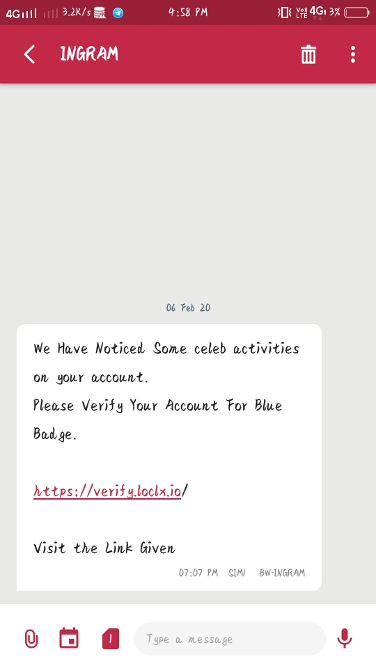
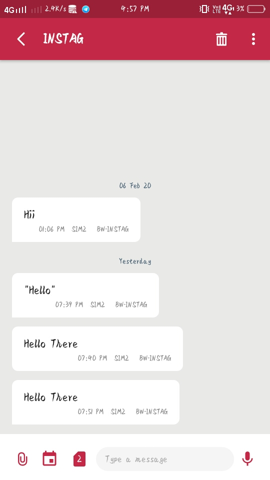

# SendSMS

SendSMS is a Python Script  To Send SMS Wity Any Sender ID




**See The Sender IDs**


## Installation

```
apt update && apt upgrade
pkg install git
git clone https://github.com/this-is-space/SendSMS
pip install requests
```

## Usage

```
cd SendSMS
python3 sms.py

Press 1 And Enter The TOKEN after that Run Again

python3 sms.py

Press 2 and Send SMS

```

## Buy Token

To Buy Token :- WhatsApp  At :- +91 82993 57332

[WhatsApp Now](https://wa.me/918299357332)

or Contact  On Telegram  

[Telegram](t.me/this_is_space)
